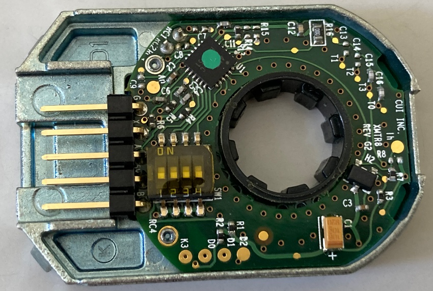

# ロータリーエンコーダを読む

エンコーダは[AMT102-V](https://www.digikey.jp/ja/products/detail/same-sky-formerly-cui-devices-/AMT102-V/827015?gclsrc=aw.ds&&utm_adgroup=&utm_source=google&utm_medium=cpc&utm_campaign=Pmax%20Shopping_Product_Medium%20ROAS&utm_term=&productid=827015&utm_content=&utm_id=go_cmp-20190420439_adg-_ad-__dev-c_ext-_prd-827015_sig-Cj0KCQjwhMq-BhCFARIsAGvo0KepiliL5UMokL4bXzAq1rxj0amR6aMMbkjXr6ANuMr8IIp5-BnlpJoaArLIEALw_wcB&gad_source=1&gclid=Cj0KCQjwhMq-BhCFARIsAGvo0KepiliL5UMokL4bXzAq1rxj0amR6aMMbkjXr6ANuMr8IIp5-BnlpJoaArLIEALw_wcB&gclsrc=aw.ds)を使用した。  

エンコーダを読むことで移動距離などを計算できる。エンコーダにはA相とB相を用いて回転方向と回転量をアナログ値として読み取ることができるらしい。  
マイコンのピンの`SPI◯_MISO`と`SPI◯_MOSI`の機能を使用していると予想。タイマーのエンコーダモードを使用する。  
`[プロジェクト名].ioc`-`Pinout & Configuration`-`Timers`-`TIM3`-`Mode`-`Combined Channels`を`Encoder Mode`、`Configuration`-`Parameter Settings`-`Counter Settings`-`Counter Period`を`8192`、`Encoder`-`Encoder Mode`を`Encoder Mode TI1 and TIT2`に設定。今回は`TIM3`を使用した。  
`printf`を使用する。  
`main.c`  
```c
/* USER CODE BEGIN 0 */
int over;

void HAL_TIM_PeriodElapsedCallback(TIM_HandleTypeDef* htim){
	if(htim->Instance == TIM3){
		__HAL_TIM_CLEAR_FLAG(&htim3,TIM_IT_UPDATE);
		if(__HAL_TIM_IS_TIM_COUNTING_DOWN(&htim3)){
			over--;
		}else{
			over++;
		}
    }
}
/* USER CODE END 0 */

/* USER CODE BEGIN 2 */
STprintf(&huart2);
HAL_TIM_Encoder_Start(&htim3, TIMCH_ALL);
HAL_TIM_Base_Start_IT(&htim3);
int count;
over = 0;
/* USER CODE END 2 */

/* USER CODE BEGIN WHILE */
while (1)
{
    // count = TIM3 -> CNT;
    count = (long)(over * 8192) + (long)TIM3 -> CNT;
    printf("%d\r\n",count);
    HAL_Delay(100);
/* USER CODE END WHILE */
```  

エンコーダの回転量を`TIM3 -> CNT`でゲットし表示する。ただ`8192`を上回るまたは`0`を下回ると`8192`から`0`にまたは`0`から`8192`に飛ぶ。  
それを解決するためにオーバーフローを検知しその回数を記録し`count`に反映させる。`HAL_TIM_PeriodElapsedCallback`関数はオーバーフローが起こった時に実行される関数であるため、そこにオーバーフローの回数を記録する。一回転が`8192`であるから`over * 8192`で増分を増やす。一回転が`8192`であるのはエンコーダのデータシートに記載されていて内部のディップスイッチが`1`~`4`までが全て`0`になっている場合、一回転は`2048 * 4`の`8192`になると書かれている。  
  

### 角度を求めてみる  
回転量から回転回数や基準からの角度などを求められる。`((float)count / 8192) * 360`で1周`360°`になる。ただし`count`はもともと`int`型なので計算結果を少数にするために`float`型にキャスト変換する。また、以下のコードで角度を`0°`~`360°`にすることで何周しても同じ角度になるようにすることができる。  
`以下のコード`  
```c
while(deg > 360){
    deg = deg - 360;
}
while(deg < 0){
    deg = deg + 360;
}
```  
また、スイッチが押されたらその場所を基準としてそこからの角度を表示できるようにすると良いかもしれない。するとすれば`over`と`TIM3->CNT`をそれぞれ`0`にする必要がある。  
  

#### 参考
* [【Nucleo入門】Nucleo-F401でエンコーダ読み取り(STM32CubeIDE、macOS版)](https://www.shujima.work/entry/2019/05/28/221629)  